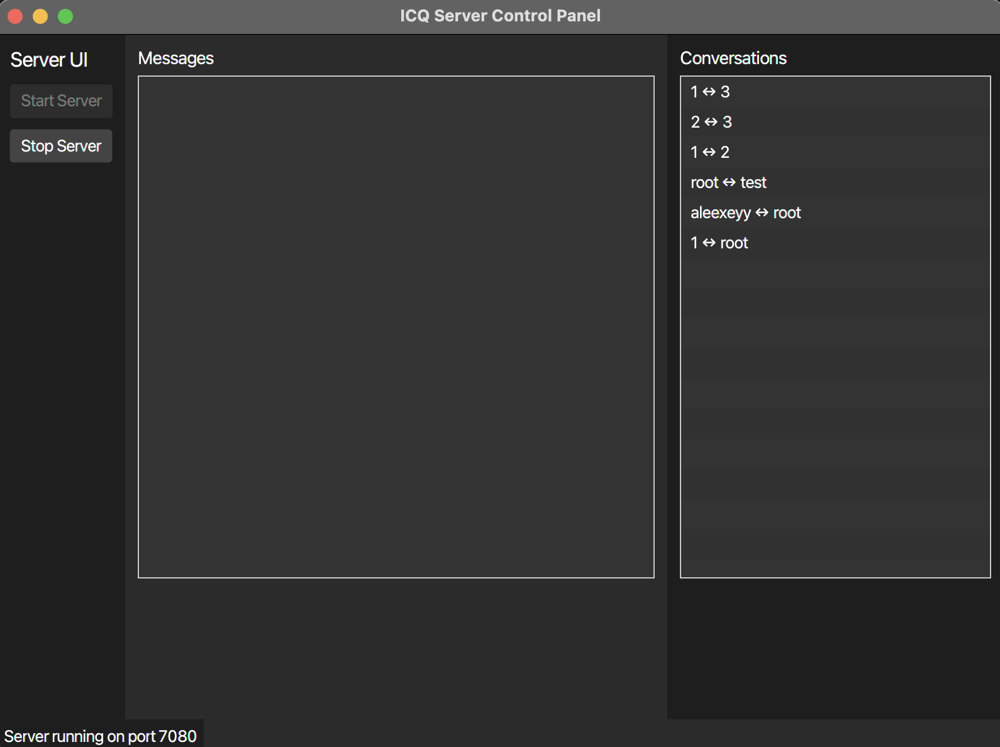

# Java Messenger App


A simple, cross‑platform messenger application written in Java. It allows users to register, log in, and send real‑time text messages to individuals.

---

## Table of Contents

1. [Features](#features)  
2. [Screenshots](#screenshots)  
3. [Getting Started](#getting-started)  
   - [Prerequisites](#prerequisites)  
   - [Installation](#installation)

---

## Features

- User registration & authentication  
- One‑on‑one chat  
- Presence/status updates  
- Message history persistence  

---

## Screenshots

> **Where to put screenshots:**  
> - Create a folder `assets/images/` at the project root.  
> - Name files meaningfully:  
>   - `logo.png`  
>   - `login_screen.png`  
>   - `registration_screen.png`  
>   - `chat_screen.png`  

1. **Login/Registration Screen**  
     
2. **Main Chat Window**  
   
3. **Server Side UI**
     
4. **General Look**
     
---

## Getting Started

### Prerequisites

- Java 17 or higher  
- Maven 3.6+ (or Gradle if you prefer)  
- MySQL database (for message persistence)
- JavaFX 17 or higher

### Installation

1. **Clone the repo**  
   ```bash
   git clone https://github.com/your-username/java-messenger.git
   cd java-messenger

2. **Configuration**
    Set the environmental variables:
    DB_URL
    DB_USERNAME
    DB_PASSWORD
    Optional(WEBSOCKET_PORT) 
